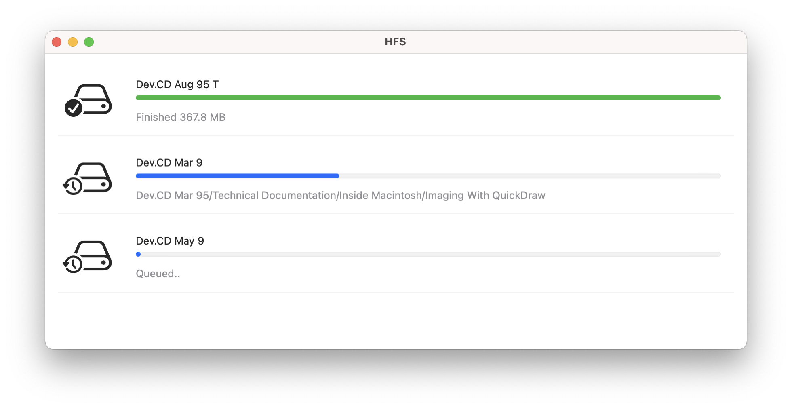

# HFS
A Mac application to copy/extract HFS volumes

[Download](https://github.com/kevinbrewster/HFS/releases/download/0.1/HFS.app.zip)

## Background

HFS.app uses the [HFSKit framework](https://github.com/kevinbrewster/HFSKit) under the hood.
